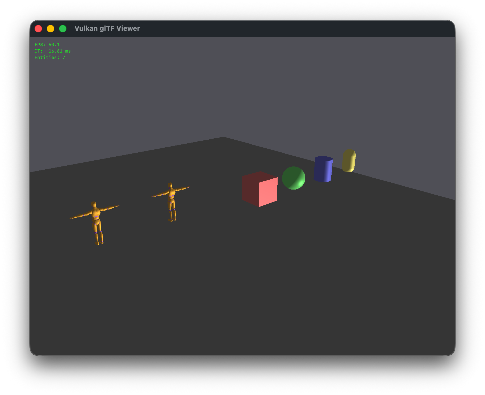

# Safi ECS Game Engine

A Vulkan-based ECS game engine built with C# and C++. C# drives the main loop and all game logic through an Entity Component System, while a C++ shared library handles Vulkan rendering — connected via Mono P/Invoke.



## Features

- **Entity Component System** — Bevy-inspired ECS with entity spawning/despawning, component queries, and ordered system execution
- **Vulkan Renderer** — C++ rendering backend with swapchain management, depth testing, and automatic window resize handling
- **glTF Model Loading** — Load `.glb`/`.gltf` models via cgltf with vertex positions, normals, and colors
- **Multi-Entity Rendering** — Spawn multiple entities with independent transforms using per-entity push constants
- **Procedural Primitives** — Generate box, sphere, plane, cylinder, and capsule meshes without external files
- **Dynamic Lighting** — Up to 8 simultaneous lights (directional, point, spot) with Blinn-Phong shading
- **Camera System** — Orbit (third-person), first-person, and free debug fly camera with mouse look, zoom, and mode switching
- **Keyboard & Mouse Input** — WASD/arrow key movement, mouse look, scroll wheel zoom, mouse buttons, cursor lock toggle
- **Parent-Child Hierarchy** — Entity relationships with automatic world-space transform propagation
- **Debug Overlay** — FPS counter, delta time, and entity count rendered as GPU text via a second Vulkan pipeline with stb_truetype font atlas; toggled with F3
- **Timers** — Countdown and interval timers for cooldowns, spawning, and delays
- **Delta Time** — Frame-independent movement via native-side GLFW timing
- **Runtime Spawn/Despawn** — Create and destroy entities at runtime with automatic native resource cleanup
- **macOS App Bundle** — Packageable as a standalone `.app` with embedded runtime and assets

## Quick Start

### Prerequisites

- [Mono](https://www.mono-project.com/) (`mcs`, `mono`)
- [CMake](https://cmake.org/) (>= 3.20)
- [Vulkan SDK](https://vulkan.lunarg.com/) (MoltenVK on macOS)
- [GLFW](https://www.glfw.org/) and [GLM](https://github.com/g-truc/glm) — `brew install glfw glm`
- **glslc** (SPIR-V shader compiler, included with Vulkan SDK)

### Build & Run

```sh
make run
```

This compiles GLSL shaders to SPIR-V, builds the C++ shared library via CMake, compiles all C# sources with Mono, and launches the viewer with the correct MoltenVK environment.

### Controls

#### Player Camera (default)

| Input               | Action                             |
| ------------------- | ---------------------------------- |
| WASD / Arrow Keys   | Rotate player entity               |
| ESC                 | Toggle cursor lock for mouse look  |
| Mouse (when locked) | Orbit camera yaw/pitch             |
| Q / E               | Camera yaw                         |
| R / F               | Camera pitch                       |
| Scroll wheel        | Zoom in/out (third-person)         |
| TAB                 | Toggle first-person / third-person |

#### Free Camera (debug)

| Input               | Action                                          |
| ------------------- | ----------------------------------------------- |
| 0                   | Activate free camera (debug mode only)          |
| 1                   | Deactivate free camera, return to player camera |
| WASD                | Fly forward/back/left/right                     |
| Q / E               | Fly down / up                                   |
| Mouse (when locked) | Look around                                     |
| ESC                 | Toggle cursor lock                              |

#### Global

| Input | Action                                       |
| ----- | -------------------------------------------- |
| F3    | Toggle debug overlay (FPS, DT, entity count) |

## Architecture

```
C# ECS (managed/ecs/)              C++ VulkanRenderer (native/)
  World — entities, components        Vulkan instance, swapchain, pipeline
  Systems — per-frame logic           Vertex/index buffers, push constants
  NativeBridge.cs                     UBOs for view/proj + lighting
       └──── P/Invoke (DllImport) ────→ bridge.cpp (extern "C")
```

The C# side owns the game loop and all ECS logic. Each frame it queries entities, runs systems in order, and pushes transforms and light data to the native renderer. The C++ side manages all GPU resources, shader pipelines, and draw calls.

### ECS Pattern

- **Components** — Plain C# classes (data only): `Transform`, `MeshComponent`, `Movable`, `Light`, `Camera`
- **Systems** — Static methods that query and mutate the world: `InputMovementSystem` → `FreeCameraSystem` → `CameraFollowSystem` → `LightSyncSystem` → `HierarchyTransformSystem` → `DebugOverlaySystem` → `RenderSyncSystem`
- **World** — Manages entity lifecycles, component storage, system registration, and delta time

System execution order matters — `RenderSyncSystem` must always run last.

### Adding a New Native Function

Changes are required in three places:

1. `native/bridge.cpp` — `extern "C"` wrapper
2. `native/renderer.h` + `renderer.cpp` — Implementation on the `VulkanRenderer` class
3. `managed/ecs/NativeBridge.cs` — `[DllImport("renderer")]` declaration

Any new C# file must be added to the `VIEWER_CS` list in the Makefile.

## Make Targets

| Target         | Description                            |
| -------------- | -------------------------------------- |
| `make run`     | Build everything and run the viewer    |
| `make viewer`  | Build shaders + native lib + C# exe    |
| `make app`     | Build macOS `.app` bundle              |
| `make shaders` | Compile GLSL → SPIR-V only             |
| `make clean`   | Remove all build artifacts             |
| `make all`     | Build hello demo (basic P/Invoke test) |
| `make help`    | Show available targets                 |

## Project Structure

```
.
├── Makefile                          # Build automation
├── build-app.sh                     # macOS .app packaging script
├── native/
│   ├── CMakeLists.txt               # CMake config for shared library
│   ├── renderer.cpp                 # Vulkan renderer implementation
│   ├── renderer.h                   # Renderer class declaration
│   ├── bridge.cpp                   # C-linkage P/Invoke bridge
│   ├── shaders/
│   │   ├── shader.vert              # Vertex shader (GLSL 4.5)
│   │   ├── shader.frag              # Fragment shader (Blinn-Phong lighting)
│   │   ├── ui.vert                  # UI vertex shader (2D pixel-to-NDC)
│   │   └── ui.frag                  # UI fragment shader (font atlas sampling)
│   └── vendor/
│       ├── cgltf.h                  # glTF 2.0 parsing library
│       └── stb_truetype.h           # Font rasterization library
├── managed/
│   ├── Viewer.cs                    # Entry point — spawns entities, runs game loop
│   └── ecs/
│       ├── World.cs                 # ECS world: entities, components, systems
│       ├── Components.cs            # Transform, MeshComponent, Movable, Light, Camera
│       ├── Systems.cs               # Input, camera, lighting, render sync systems
│       ├── NativeBridge.cs          # P/Invoke bindings to C++ renderer
│       ├── FreeCameraState.cs       # Static state for the debug free camera
│       └── GameConstants.cs         # Tunable config values (debug, sensitivity, speed)
├── assets/
│   └── fonts/
│       └── RobotoMono-Regular.ttf   # Monospace font for debug overlay
├── models/                          # glTF models (.glb)
├── docs/                            # Rspress user-facing documentation site
├── technical_docs/                  # Rspress technical/renderer internals docs
├── plans/                           # Roadmap and planning docs
└── build/                           # Generated build artifacts
```

## Documentation

The project includes two [Rspress](https://rspress.dev/) documentation sites:

- **`docs/`** — User-facing docs covering architecture, ECS usage, and the feature roadmap
- **`technical_docs/`** — Renderer internals: Vulkan pipeline setup, shaders, data structures, bridge API

```sh
cd docs && bun install && bun run dev              # User docs dev server
cd technical_docs && bun install && bun run dev    # Technical docs dev server
```

## Roadmap

The engine currently implements 21 core features. The [full roadmap](plans/features.md) tracks 100+ planned features across rendering (textures, PBR, shadows), animation (skeletal, blending), physics (collision, rigidbody), scene management, audio, UI, AI, and cross-platform support including web export.

## Support

[](https://ko-fi.com/J3J11RP7T5)
