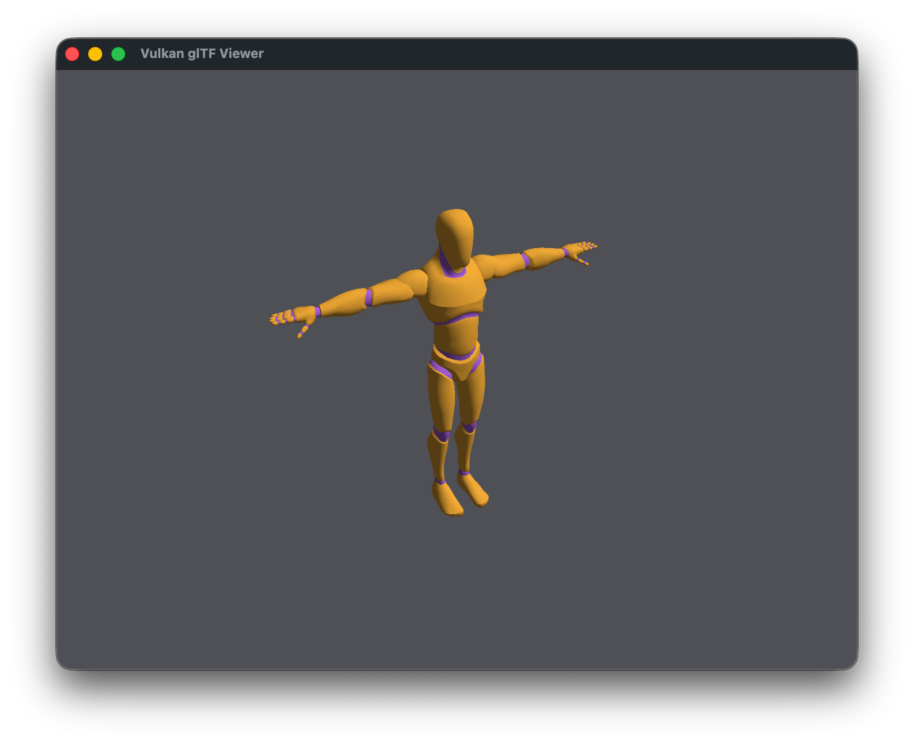

# C++ / C# Vulkan glTF Viewer

A Vulkan-based glTF model viewer where C# drives the main loop and a C++ shared library handles all rendering, connected via Mono P/Invoke.



## How It Works

1. **C++ shared library** (`native/renderer.cpp`, `native/bridge.cpp`) — Vulkan renderer that loads glTF models via cgltf, with C-linkage bridge functions
2. **C# program** (`managed/Viewer.cs`) — Uses `[DllImport("renderer")]` to drive the render loop and handle keyboard input
3. **Mono runtime** — Loads the `.dylib` and marshals calls between managed and native code
4. **CMake** — Builds the native library and generates `compile_commands.json` for IDE support

## Prerequisites

- **Mono** (`mcs`, `mono`)
- **CMake** (>= 3.20)
- **Vulkan SDK** (MoltenVK on macOS)
- **GLFW** and **GLM** (e.g. `brew install glfw glm`)
- **glslc** (SPIR-V shader compiler, included with Vulkan SDK)

## Quick Start

```sh
make run
```

Use arrow keys or WASD to rotate the model. Press ESC to capture the cursor for mouse look; press ESC again to release.

## Make Targets

| Target    | Description                                          |
| --------- | ---------------------------------------------------- |
| `all`     | Build hello demo `.dylib` and C# `.exe` (default)    |
| `viewer`  | Build Vulkan glTF viewer (shaders + native lib + C#) |
| `run`     | Build and run the viewer                             |
| `app`     | Build macOS `.app` bundle (requires Mono installed)  |
| `shaders` | Compile GLSL shaders to SPIR-V                       |
| `clean`   | Remove build artifacts                               |
| `help`    | Show available targets                               |

## Project Structure

```
.
├── Makefile
├── build-app.sh             # macOS .app bundle packaging script
├── native/
│   ├── CMakeLists.txt       # CMake build for the shared library
│   ├── renderer.cpp         # Vulkan renderer implementation
│   ├── renderer.h           # Renderer class declaration
│   ├── bridge.cpp           # C-linkage bridge for P/Invoke
│   ├── shaders/
│   │   ├── shader.vert      # Vertex shader (GLSL)
│   │   └── shader.frag      # Fragment shader (GLSL)
│   └── vendor/
│       └── cgltf.h          # glTF parsing library
├── managed/
│   ├── Viewer.cs            # C# viewer entry point
│   └── ecs/
│       ├── World.cs         # ECS world: entities, components, systems
│       ├── Components.cs    # Transform, MeshComponent, Movable, Camera
│       ├── Systems.cs       # Input, camera, and render-sync systems
│       └── NativeBridge.cs  # P/Invoke bindings to C++ renderer
├── models/                  # glTF models (.glb)
└── build/                   # Generated build artifacts
```
